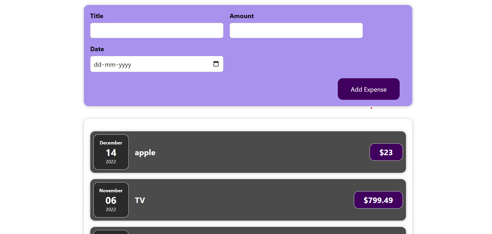

# **ADD-ITEMS**

The add-items project in React using React hooks would involve creating a simple application that allows users to add items to a list.The application would use React hooks, such as useState to manage the state and behavior of the components. The user would be able to enter an item into an input field and add it to the list by clicking a button. The list of items would be displayed on the screen .

## Images

## Trainer Target

- React Components
- props
- useState hook

## Trainee Achieved

- knowledge of making components
- passing of props from one component to another component
- using of useState hook

## Tech stack

### _Language_ : HTML, CSS, Javascript, React
